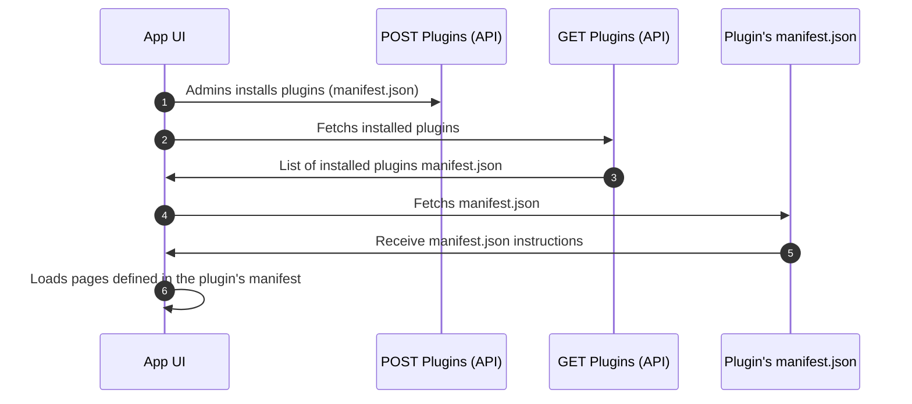

import PageHeader from '@site/src/components/PageHeader';

<PageHeader title="UI Plugin" insideContent />

# Let's Get Started

Let's walk through a minimal setup of a plugin to explain clearly how plugins systems works.

## Minimal Structure

```
# Example of a minimalist plugin structure

|- manifest.json
|- index.html
|- my-app.js
|- my-app.css
```

### Manifest

`manifest.json` is the entrypoint of every plugin. It defines generic information about the plugin (_authors_, _name_, _icons_, ...), but also **give directives about all pages** the plugins want to display and where to display them.

The concept is the same for each plugin type (_app_, _mobile_ or _portal_). Developers must defines `staticTabs` key, all the pages and related content URL.

```json
{
  // ...
  // Specifies the targeted Wazo product for this plugin
  "productType": "app",

  "staticTabs": [
    {
      "entityId": "plugin-tab-id",
      // Context where the tab will be accessible (depends on `productType`)
      "context": ["generalTab"],
      // Name of the plugin page
      "name": "SMS",
      // URL or path to show UI
      "contentUrl": "./sms.html"
    }
  ],
}
```

### HTML

`index.html` will contains all the structure of a page, texts and need to includes all your `js`/`css` files. Based the `manifest.json` the plugin tab will point to this file directly from an `iframe`.

```html
<!doctype html>
<html>
  <head>
    <link href="./my-app.css" rel="stylesheet" />
  </head>
  <body>
    <h1>Minimalist Plugin</h1>
    <script type="module" src="./my-app.js"></script>
  </body>
<html>
```

### JavaScript

`my-app.js` contains all the logic of your plugin. You must [install our SDK](/docs/sdk-librairies/plugins-js-sdk) to get the `context` surrounding your plugin. By initialize the SDK in you plugin, you will retreive info like the authenticated user UUID.

```js
import { App } from '@wazo/euc-plugins-sdk';

const wazoApp = new App();

(async () => {
  await wazoApp.initialize();
  const context = wazoApp.getContext();

  console.log(context.user.uuid);
})();
```

### Style Sheet

`my-app.css` contains styles of you plugin. Since your plugin is inside an `iframe`, you can redefine all styles by yourself and it won't impact our design.


```css
/* Dark background for my plugin  */
.body {
  background: #222;
  color: #FFF;
}
```

:::info
Our products are build on top of [MUI](https://mui.com/), we suggest using this library keep same design between our apps and your plugin.
:::

## Structure Overview

Visual learners, here's a simplified view of how our Wazo Apps interacts with plugins tabs. Also you can see that plugin can also Wazo Apps by using the available [SDK methods](/docs/sdk-librairies/plugins-js-sdk/plugins-apis). This concepts applies to all our products: Apps, Mobile and Portal.


---

Here's is another sequence diagram on how our apps retreive information of installed plugins at a tenant level. We store only an URL where the manifest.json is stored on your infrastructure. All plugin implementation details are inside the plugin `manifest.json`, so you have the full control on your plugin ecosystem.


